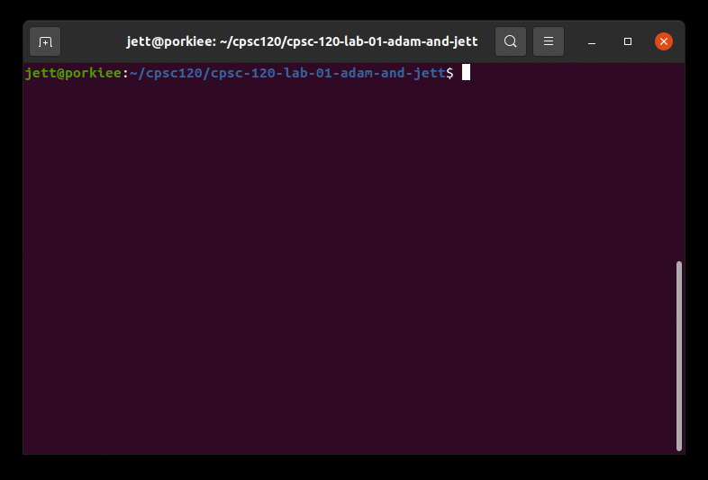
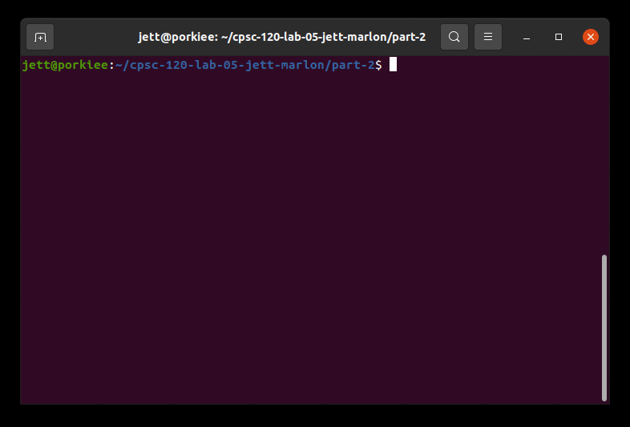
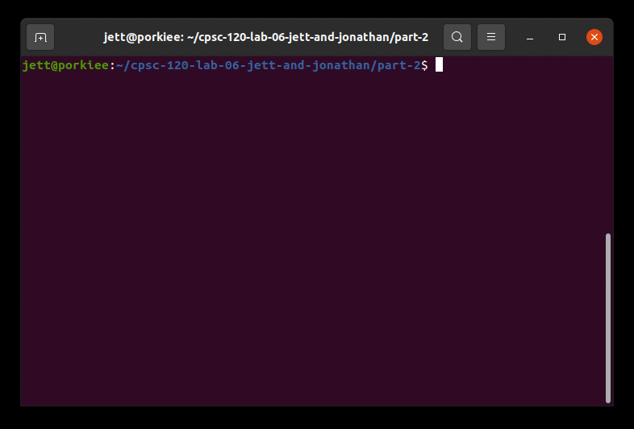

# Portfolio 

This is my home page! My name is Jett Le and I am a student at [Cal State Fullerton](http://www.fullerton.edu/) and my major is Computer Science. 

## Computer Science Projects 

My GitHub page is https://github.com/jettle056.

### CPSC120

* Lab 1 

Lab 1 was one of my favorites. It was my first time ever coding. It wasn't that hard but at the same time it was still challenging. 

* Lab 5

Lab 5, part 2 was one of my favorites. It was also one the most challenging labs I have ever done. However, I was able to write functions and make a program to play Blackjack.

* Lab 6

Lab 6, part 2 was one of my favorites. With the past labs, I was able to use those experience to be able to write the functions of calculating the average given as command-line arguments. This was a very great experience. 

